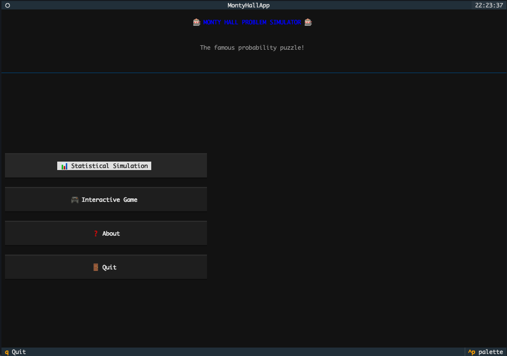
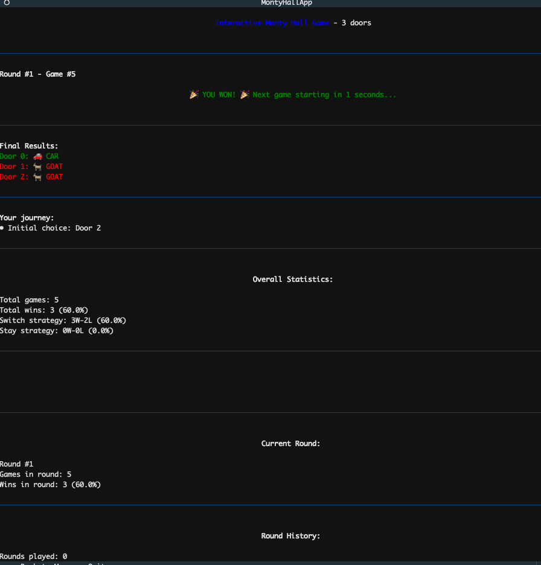
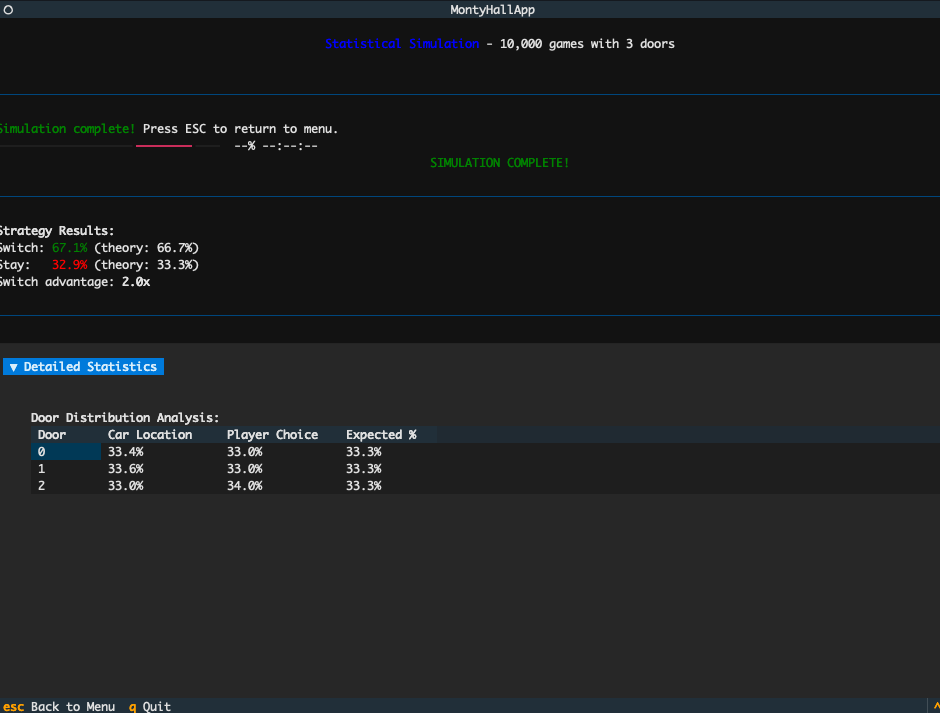

# Monty Hall Simulator

A terminal-based simulator for the famous Monty Hall probability puzzle, featuring both interactive gameplay and statistical simulations.

## Features

- **Interactive TUI**: Play the Monty Hall game with an intuitive terminal interface
- **Statistical Simulation**: Run simulations to verify the probabilities for yourself
- **Customizable Parameters**: Adjust the number of doors and simulation runs
- **Command-line Interface**: Quick simulations for scripting or analysis

## Installation

This project uses [uv](https://github.com/astral-sh/uv) for package management and virtual environments.

1. Install uv (if you haven't already):
   ```bash
   curl -LsSf https://astral.sh/uv/install.sh | sh
   ```

2. Clone the repository:
   ```bash
  git clone https://github.com/matchagradient/monty-hall-sim.git
  cd monty-hall-sim
   ```

3. Create a virtual environment and install dependencies:
   ```bash
   uv venv
  uv pip install -e .
   ```

## Usage

### Interactive TUI Mode

Launch the interactive terminal user interface:

```bash
uv run python montyhall.py
```

Or if your virtual environment is already activated:

```bash
python montyhall.py
```

In the TUI, you can:
- Play an interactive game with customizable number of doors
- Run statistical simulations with configurable parameters
- View detailed statistics and probability distributions
- Learn about the Monty Hall problem in the "About" section

### Command-line Simulation

For quick simulations without the TUI, use the command-line options:

```bash
# Run a simulation of 10,000 games with 3 doors
python montyhall.py -s 10000 -d 3

# Run a simulation with 50,000 games and 10 doors, with quiet output
python montyhall.py -s 50000 -d 10 -q

# Force TUI explicitly
python montyhall.py --tui

# See all available options
python montyhall.py --help
```

## Examples

### Example 1: Basic Simulation

```bash
$ python montyhall.py -s 10000 -d 3

Monty Hall Simulation Results:
==================================================
Games: 10,000 | Doors: 3
Switch Strategy: 6,689 wins (66.9%) - Theory: 66.7%
Stay Strategy:   3,311 wins (33.1%) - Theory: 33.3%
Switch Advantage: 2.0x better
```

### Example 2: More Doors

```bash
$ python montyhall.py -s 10000 -d 10

Monty Hall Simulation Results:
==================================================
Games: 10,000 | Doors: 10
Switch Strategy: 9,012 wins (90.1%) - Theory: 90.0%
Stay Strategy:   988 wins (9.9%) - Theory: 10.0%
Switch Advantage: 9.1x better
```

## The Monty Hall Problem

The Monty Hall problem is a famous probability puzzle based on the American game show "Let's Make a Deal". It demonstrates how counter-intuitive probability can be.

### The Setup

1. There are three doors: behind one door is a car; behind the others, goats.
2. You pick a door (say, No. 1).
3. The host, who knows what's behind the doors, opens another door (say, No. 3) which has a goat.
4. He then asks if you want to switch to door No. 2 or stick with your original choice.

### The Surprise

- If you stick with your original choice, you have a 1/3 chance of winning the car.
- If you switch, you have a 2/3 chance of winning the car!

With more doors, the advantage of switching becomes even more dramatic. For example, with 100 doors:
- Staying gives you a 1% chance of winning.
- Switching gives you a 99% chance of winning!

## Contributing

Contributions are welcome! Please feel free to submit a Pull Request.

1. Fork the repository
2. Create a feature branch (`git checkout -b feature/amazing-feature`)
3. Commit your changes (`git commit -m 'Add some amazing feature'`)
4. Push to the branch (`git push origin feature/amazing-feature`)
5. Open a Pull Request

## License

This project is licensed under the MIT License - see the [LICENSE](LICENSE) file for details.

## Acknowledgments

- Inspired by the famous probability puzzle and the TV show "Let's Make a Deal"
- Built with [Textual](https://textual.textualize.io/) for the beautiful terminal interface
- Uses [uv](https://github.com/astral-sh/uv) for fast Python package management

## Screenshots



Interactive gameplay:



Simulation view:


